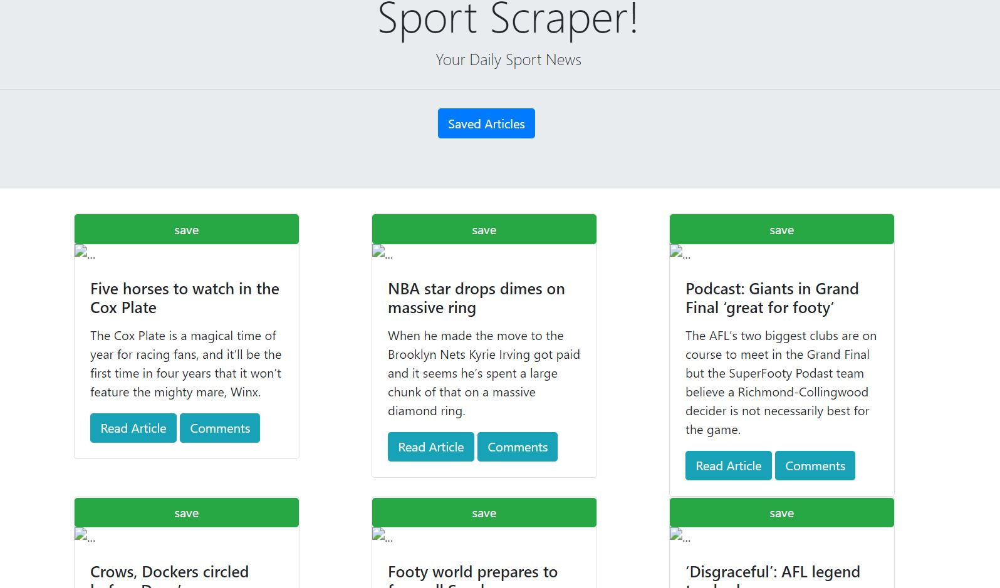
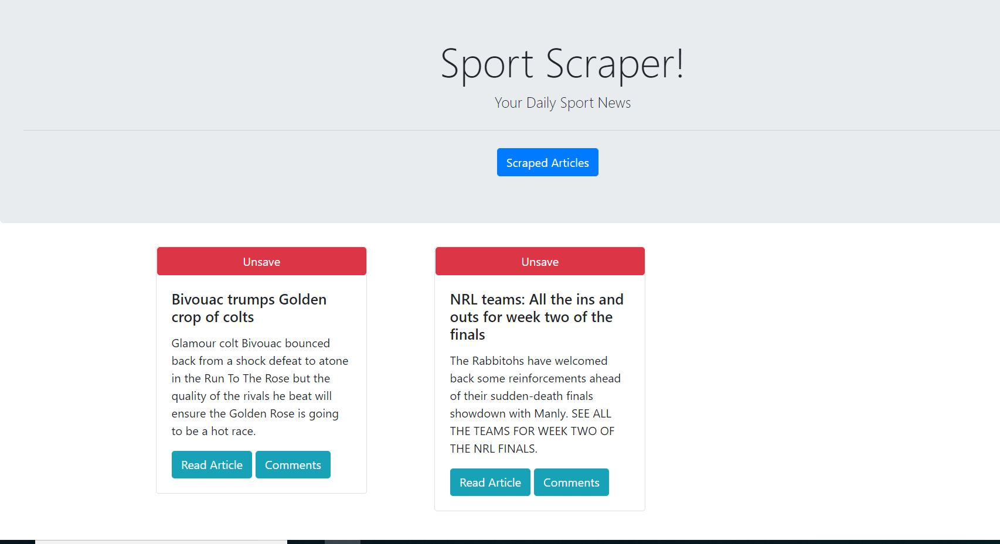
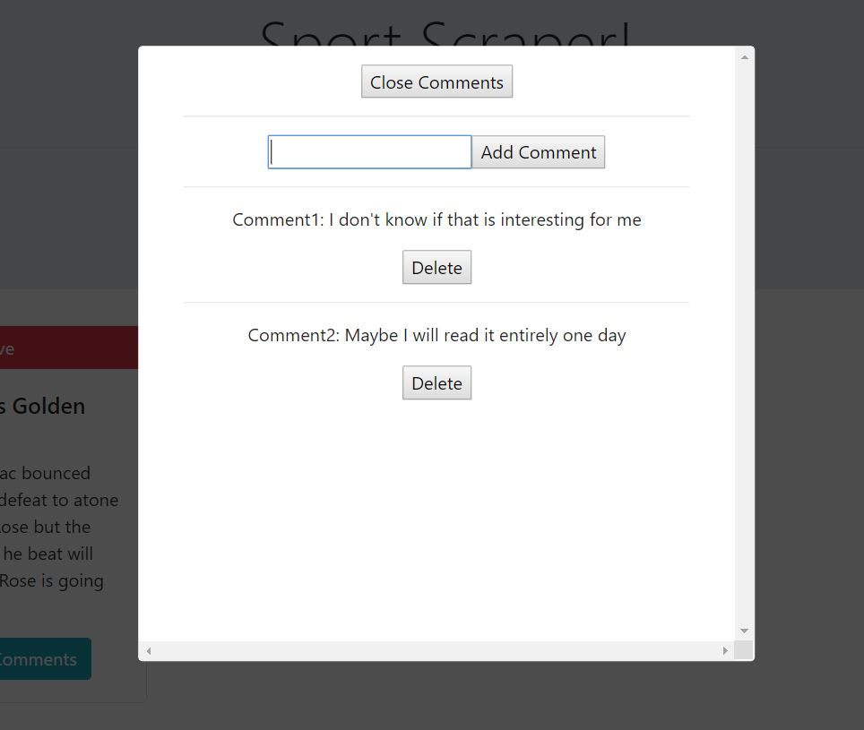

#  Sport Scraper

The Sport scrape App is built to Scrape the the latest sport News from https://www.news.com.au/sport and present it to the users. the Users will then be able to save their favorite articles and add or delete notes/comments to them.

# App Instruction

### Open your Browser and go to  https://scraper-hani.herokuapp.com/ .

### you will get this page with the latest scraped news :

### When clicking Save (on each article) the article gets saved and you can then view it with all the saved articles by clicking the saved articles button

### Clicking on Comment, the UI will display an overlay element that allows you to add or comments/notes

# Technologies Used:

### NODE JS
### MONGO DB
### EXPRESS
### CHEERIO
### MONGOOSE